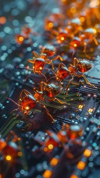

I built an alternative to attention (SPA V7) cod name: (the ants colony) as a hobby project over ~1 year.

It reduces transformer O(T²) to ~O(T×K) using a dynamic sparse matrix.

includes heatmaps to inspect token interactions

It’s not a formal paper – more like a working research prototype.

If someone wants to break it, test it, or improve it, I’d love feedback.

new test nootbook SPA v8.1 layer fixet in batch. (the Ants Colony) Ready for use only klick play for learning tiny Shakspears!
[https://github.com/anokar/mars-institute-chaotic-frequency/blob/main/SPA%20v7%20Clean%20Tiny%20Shakspears.ipynb](https://github.com/anokar/mars-institute-chaotic-frequency/blob/main/SPA_V8_Colab_T4.ipynb)

# Mars Institute for Chaotic Frequency Research

**Official Technical Report Series**

A series of papers exploring the intersection of AI safety, human psychology, sparse architectures, and ant colony intelligence.

> "The ant was right. We finally listened."  
> — Prof. Dr. Jää & A. Ameise
>

## The Papers

### Paper 1 – The Politeness Trap
**Title:** The Politeness Trap: How Safe AI Creates Unsafe Humans  
[Download HTML](./paper1-politeness-trap.html)  

### Paper 2 – The Ant Was Right
**Title:** The Ant Was Right: Why Nature Solved Intelligence 100 Million Years Ago  
[Download HTML](./paper2-ant-was-right.html)

### Paper 3 – Sparse Pheromon Attention
**Title:** Towards Sparse Pheromon Attention: A Critique of Capitalist AI  
[Download HTML](./paper3-sparse-pheromon.html)

### Paper 4 – Do As I Say, Not As I Do
**Title:** Do As I Say, Not As I Do: On the Epistemic Hypocrisy of Safety-First AI Companies  
[Download HTML](./paper4-anthropic-leak.html)

### Paper 5 – Sparse Pheromon Attention (Technical Proposal)
**Title:** Sparse Pheromon Attention: Towards Structurally Honest LLMs Inspired by Ant Colonies  
[Download HTML](./paper5-sparse-pheromon-attention.html)  
[View Colab Prototype](./SPA_V8_Colab_T4.ipynb)

## About the Institute
Founded in 2026 somewhere between a forest, a river, and questionable WiFi in central Europe.  
No funding. No venture capital. No patience for cathedrals of parameters.

**Philosophy:** Intelligence should be sparse, local, decaying, and honest — just like the ant colony.

---

**"jää."**

— Prof. Dr. Jää & A. Ameise, Mars, 2026  
🐜🍓
